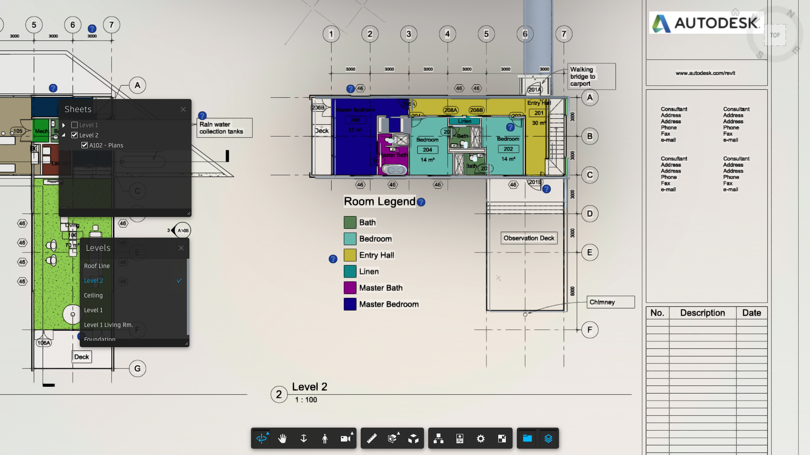
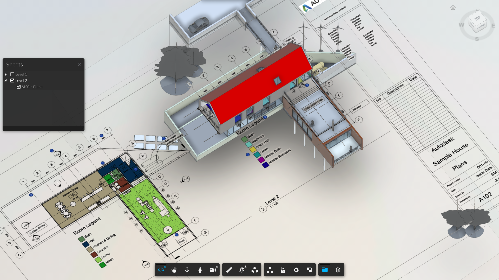

# forge-viewer-hypermodeling-revit

# Description

This sample is a revision of the [Learn Forge](http://learnforge.autodesk.io) node.js tutorials demonstrating how to use hypermodeling ext in Forge Viewer.

## Note for Revit model configuration

1. The `AecModelData` will be produced for models of Revit 2018 and later, see:
    - https://forge.autodesk.com/blog/consume-aec-data-which-are-model-derivative-api
    - https://forge.autodesk.com/blog/add-revit-levels-and-2d-minimap-your-3d

2. Floor plans must be placed in sheets and only available for the blew, see [here](https://knowledge.autodesk.com/support/bim-360/learn-explore/caas/CloudHelp/cloudhelp/ENU/BIM360D-Design-Collaboration/files/GUID-0A824636-51A3-4EDC-8152-8D42CFF5616E-html.html) for details.

    - 2D sheets with floor plan views, structural plan views, or reflected ceiling plan views. Other sheets with callout or area plan views are not supported currently.
    - Sheets with the [Crop View checkbox enabled](https://knowledge.autodesk.com/support/revit-products/learn-explore/caas/CloudHelp/cloudhelp/2020/ENU/Revit-DocumentPresent/files/GUID-8BEBCEF0-CE2C-4635-8C7C-9D03503C0B79-htm.html) in Revit.
    - Views without view breaks. Views containing view breaks or view splits are not supported currently.
    - The view placed in the sheets should not contain any of [Plan Regions](https://help.autodesk.com/view/RVT/2024/ENU/?guid=GUID-594B7B97-0D59-4B03-9544-E403BD03BE48).

## Thumbnail

# Setup

To use this sample, you will need Autodesk developer credentials. Visit the [Forge Developer Portal](https://developer.autodesk.com), sign up for an account, then [create an app](https://developer.autodesk.com/myapps/create). For this new app, use **http://localhost:3000/api/forge/callback/oauth** as the Callback URL, although it is not used on a 2-legged flow. Finally, take note of the **Client ID** and **Client Secret**.

### Run locally

Install [NodeJS](https://nodejs.org).

Clone this project or download it. It's recommended to install [GitHub Desktop](https://desktop.github.com/). To clone it via command line, use the following (**Terminal** on MacOSX/Linux, **Git Shell** on Windows):

    git clone https://github.com/autodesk-forge/forge.learning.viewmodels
    git checkout nodejs

To run it, install the required packages, set the enviroment variables with your client ID & Secret and finally start it. Via command line, navigate to the folder where this repository was cloned to and use the following commands:

Mac OSX/Linux (Terminal)

    npm install
    export FORGE_CLIENT_ID=<<YOUR CLIENT ID FROM DEVELOPER PORTAL>>
    export FORGE_CLIENT_SECRET=<<YOUR CLIENT SECRET>>
    npm start

Windows (use **Node.js command line** from the Start menu)

    npm install
    set FORGE_CLIENT_ID=<<YOUR CLIENT ID FROM DEVELOPER PORTAL>>
    set FORGE_CLIENT_SECRET=<<YOUR CLIENT SECRET>>
    npm start

Open the browser: [http://localhost:3000](http://localhost:3000).

## Packages used

The [Autodesk Forge](https://www.npmjs.com/package/forge-apis) packages are included by default. Some other non-Autodesk packages are used, including [express](https://www.npmjs.com/package/express) and [multer](https://www.npmjs.com/package/multer) for upload.

# Tips & tricks

For local development/ testing, consider using the [nodemon](https://www.npmjs.com/package/nodemon) package, which auto-restarts your node application after any modification to your code. To install it, use:

    sudo npm install -g nodemon

Then, instead of **npm run dev**, use the following:

    npm run nodemon

Which executes **nodemon server.js --ignore www/**, where the **--ignore** parameter indicates that the app should not restart if files under the **www** folder are modified.

## Troubleshooting

After installing GitHub Desktop for Windows, on the Git Shell, if you see the ***error setting certificate verify locations*** error, then use the following command:

    git config --global http.sslverify "false"

# License

This sample is licensed under the terms of the [MIT License](http://opensource.org/licenses/MIT).
Please see the [LICENSE](LICENSE) file for full details.

## Written by

Eason Kang [@yiskang](https://twitter.com/yiskang), [Forge Partner Development](http://forge.autodesk.com)